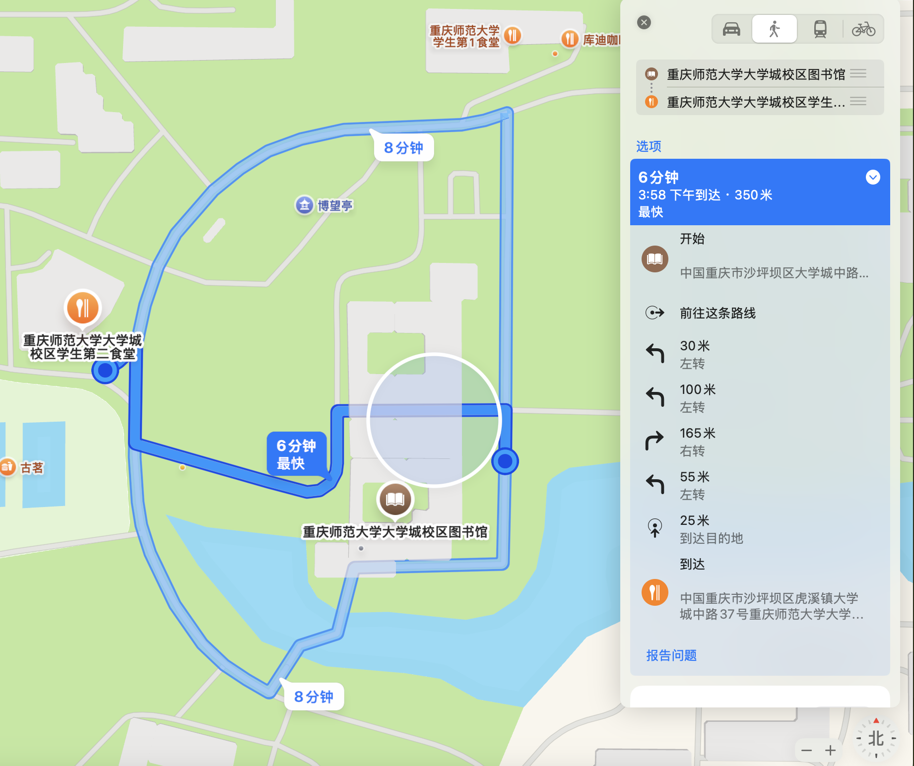
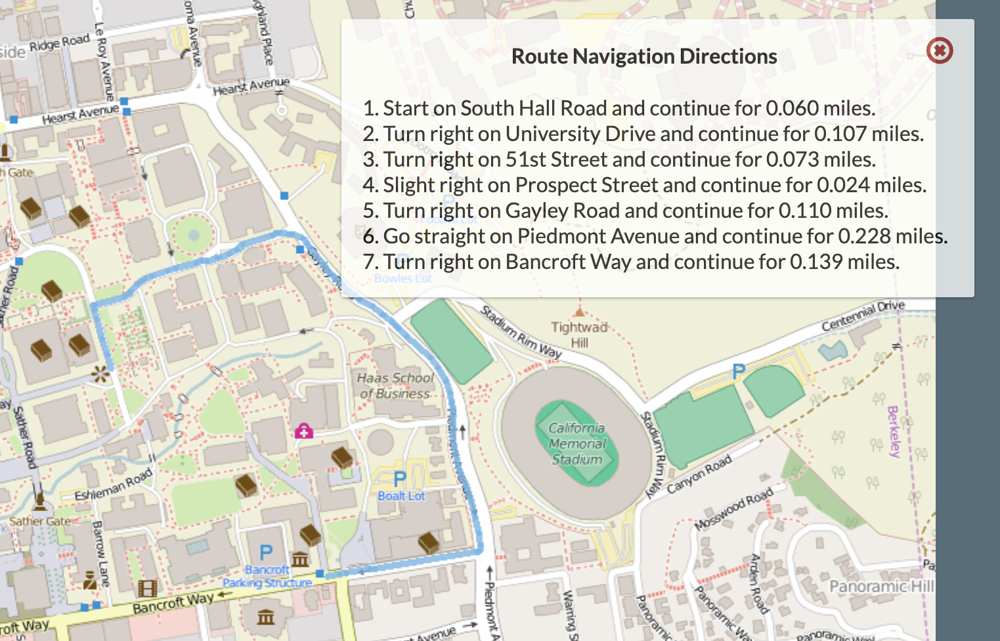
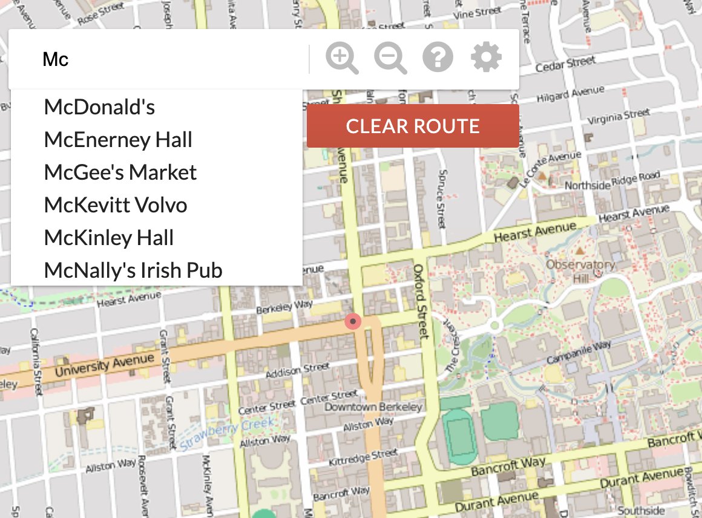

# BearMaps

**Bear Maps** 是一个基于真实地图数据的 **Web 地图应用项目**。它的灵感来源于 Google Maps 和 OpenStreetMap 项目，主要目标是让你通过构建后端逻辑来支持类似 Google Maps 的功能，包括：

1. **地图栅格化显示**：将用户请求的地图区域按照分辨率和视野要求，拼接小块图片来生成最终的地图视图。
2. **路由查找**：基于地图上的路网数据，找到从起点到终点的最短路径。
3. **位置查询和自动补全**：支持用户输入部分地名进行模糊查询，以及通过经纬度找到具体地点。
4. **可扩展性**：为后端提供一个灵活的 API，前端通过 API 请求地图数据并展示给用户。

（Josh的 [PPT](https://docs.google.com/presentation/d/1ggqEZJdNX4Rif99997PqwwOYnfzEe6NUa6qg76joC3w/edit#slide=id.g2066d56583_0_11) 与[视频讲解](https://www.youtube.com/watch?v=wqQAgG3RGNw&list=PL8FaHk7qbOD6xsQBRCY5Su-vbkf0X4gq8&index=3&ab_channel=JoshHug) ）


## **项目主要目标**

此次项目主要完成后端设计，主要有以下几个方面：

1. **实现地图栅格化（Map Rastering）**：
  - 根据用户指定的地图视野（经纬度范围、窗口大小），确定要显示的图片文件，并将这些图片拼接成一个完整的地图。
  - 核心任务：计算满足用户查询的图片文件集合及相关元数据。
2. **构建路网图（Graph Building）**：
  - 使用 OpenStreetMap 数据，将地图上的交叉路口和道路存储为图结构。
  - 解析 XML 格式的地图数据，提取节点和道路信息，构建图数据结构。
3. **最短路径搜索（Shortest Path Finding）**：
  - 实现 A* 搜索算法，在构建的图上查找从起点到终点的最短路径。
  - 优化搜索过程，使用启发式函数加快搜索速度。
4. **逐向导航（Turn-by-turn Navigation)** 

5. **位置查询和自动补全（Autocomplete & Search）**：

	- 支持通过地名模糊匹配（例如前缀搜索）和精确查询返回匹配的地理位置。

	- 使用 `Trie` 数据结构实现高效的前缀搜索。


系统后端部分部分，即整个系统的核心逻辑，包括：

1. **`Rasterer` 类**：处理地图栅格化的核心逻辑。
2. **`GraphDB` 类**：解析 XML 数据并构建图结构。
3. **`Router` 类**：实现 A* 搜索算法，并生成路线查询结果。


## Map Rastering

### 什么是栅格化

在 Bear Maps 项目中，“**地图栅格化（Map Rastering）**”指的是根据用户在网页端想查看的地图范围，把原本存储在后台的**小块地图图像（tiles）**拼接成一张整体的地图，并返回给前端显示。下面我用一个比喻来说明它的作用与原理：

想象你要拼一幅巨大的拼图，这幅拼图可以覆盖“整个城市”的范围，但实际上你只关心“你家附近的一小块街区”。在 Bear Maps 项目里，这幅“大拼图”就是我们存储的所有地图切片（tiles），而“你家附近街区”的范围，就对应用户在网页中拖拽或缩放后想要看的部分地图。

“**地图栅格化**”就是根据用户指定的“感兴趣区域”，把合适的那几张小拼图片段（tiles）取出来，把它们**拼成一整张图**并返回给浏览器显示。


**为什么需要地图栅格化？**

1. **节省带宽与计算：**
	- 若我们直接把整个超大地图一次性发给用户，无论用户只想看其中某条街道还是整个城市，前端都需要一次性处理**海量图像**，不但浪费流量，还会让加载时间过长、体验变差。
	- Bear Maps 将地图预先切割成一个个 256×256 像素的小方块（tiles），并根据不同缩放层级（depth）进行分类存储。当用户请求时，只加载必要的小方块就够了。
2. **满足用户的“分辨率”需求：**
	- 在地图应用中，我们通常有不同的“**缩放层级（zoom level）**”。越“放大”就越需要清晰的、分辨率更高的 tiles；越“缩小”就越需要更大范围但分辨率更低的 tiles。
	- 为了判断该使用哪一级别的地图 tiles，Bear Maps 引入了“**LonDPP（每像素经度跨度）**”的概念，来衡量用户所需的分辨率。如果用户的查询区域很大，就用较小分辨率（zoom out）；如果用户的查询区域很小，就用更高分辨率（zoom in）。
3. **返回用户可用的可视范围：**
	- 用户前端给出一个要查看的经纬度矩形范围（用 `ullon`, `ullat`, `lrlon`, `lrlat` 表示），加上浏览器窗口的像素宽高（`w`, `h`），后端通过栅格化计算，把覆盖这个经纬度范围的所有“小地图切片”按行列拼起来。
	- 拼接好的整张图会稍微大于或等于用户要求的区域范围，能让用户在浏览器里看到他们想看的部分。


**地图栅格化在项目中的作用**

1. **用户交互：**
	当用户在网页中拖动或缩放地图时，前端会不断发送请求给后端，例如“我现在要看从(-122.29, 37.87)到(-122.22, 37.83)的区域，浏览器窗口大小是(1085 × 566)像素”。
	- 你的后端就要“计算”：这个用户关心的区域应该用哪一层 tiles？需要拿哪些 x、y 的地图小块？然后把它们拼在一起，形成一张 2D 图像，并返回。
2. **减少不必要的数据传输：**
	- 只返回用户需要的那块地图拼图，而不是整个根地图（本项目的根地图大概覆盖伯克利地区，毕竟这是UCB CS61B的项目）；
	- 减少了网络负担和客户端的渲染负担。
3. **铺垫后续功能：**
	- 后面我们还要实现最短路径。当用户搜索两地之间的路径时，这些地图切片能够在前端**叠加**路径数据一起显示。
	- 如果我们不进行栅格化分层，前端就需要处理很大一张地图；或者不断对地图做放大缩小的插值，这都非常低效。


**让我们再来梳理一下地图栅格化的过程：**

- **“大地图”**：假设你有一张覆盖整个加州的地图，但你并不关心所有街道，只想看 UCB 校园附近。
- “切片”：这张大地图被分割成数千块小方块（tiles），每块 256×256 像素，并且按照不同“深度”（Depth 0 ~ Depth 7）做进一步切割和放大。
	- Depth 0：只有 1 块，覆盖整个区域，但十分模糊。
	- Depth 1：把整张地图分成 2×2 = 4 块，每块分辨率更高一点。
	- …
	- Depth 7：分成 128×128 = 16384 块，非常精细（但需要很多块才能覆盖同样的范围）。
- “浏览器请求”：用户在网页告诉你：
	- 我想看：**左上**角(-122.304, 37.87)到**右下**角(-122.21, 37.82)的矩形范围。
	- 我浏览器窗口是 1085 像素宽、566 像素高。
- 后端计算：
	1. 先计算用户所需的经度分辨率（LonDPP = (lrlon - ullon) / width）。
	2. 从最粗糙（Depth 0）到最精细（Depth 7），比较每级 tile 的分辨率，如果达到了不比“用户期望分辨率”更差，就选那个深度。
	3. 根据选好的深度，确定**横向 x 范围**和**纵向 y 范围**：即把用户矩形覆盖的所有 tile 的坐标都找出来。
	4. 用这些 tile 的名称（如 `d2_x0_y1.png`, `d2_x0_y2.png` 等）拼一个二维数组（String[][]），并返回给前端。
- 前端拼接：
	- 前端收到你的String[][]后，会把所有对应的图像贴到浏览器里，形成可视地图。

这样，就完成了**地图栅格化**的过程。

只要理解了它的核心目的 —— "**把合适的地图小块按用户所需范围拼成一张图片**" —— 就能掌握地图栅格化在这个项目里的重要性了。


### 计算流程

下面我会用一个“**从输入到输出**”的思路，**按顺序**讲解地图栅格化（Map Rastering）部分的**计算流程**。一步步梳理清楚该做什么、为什么要这样做、以及怎么做。

在 Bear Maps 项目中，地图被事先分成了多层（depth）的小方块（tiles），每个 tile 都是 256×256 像素。

- **Depth = 0**：整张地图只有 1 个 tile（`d0_x0_y0.png`），非常“模糊”（分辨率最低）。
- **Depth = 1**：地图被分成 2×2=4 个 tile（`d1_x0_y0.png`, …），分辨率更高一些。
- **Depth = 2**：分成 4×4=16 个 tile， …
- …
- **Depth = 7**：分成 128×128=16384 个 tile，分辨率最高。

不管哪一层，这些 tile 的**整体覆盖范围**（“地图世界”）都是固定不变的，由项目给的常量定义（在 `MapServer.java` 中）：

- `ROOT_ULLON`：根地图左上角的**经度**（longitude）
- `ROOT_ULLAT`：根地图左上角的**纬度**（latitude）
- `ROOT_LRLON`：根地图右下角的经度
- `ROOT_LRLAT`：根地图右下角的纬度
- `TILE_SIZE = 256`：每个 tile 的边长（单位：像素）


当浏览器想要看某个特定区域时，会通过类似 `/raster?...` 的请求，把下列参数提供给后端（存在一个 `Map<String, Double> params` 中）：

1. `ullon`、`ullat`：用户查询矩形的左上角（Upper Left）经度/纬度
2. `lrlon`、`lrlat`：用户查询矩形的右下角（Lower Right）经度/纬度
3. `w`（width）、`h`（height）：浏览器显示区域的宽、高（像素）

这些值说明：

- 用户想看的经纬度范围是 (`ullon`, `ullat`) 到 (`lrlon`, `lrlat`) 这块区域。
- 他们的浏览器窗口大小大约是 `w`×`h` 像素。

**我们要做的**：根据这个矩形范围与像素需求，**选出合适的地图层级（depth)和覆盖这些经纬度的所有 tile**，拼接成一个二维数组返回给前端。


### **计算步骤与代码**

1. **计算用户查询的分辨率**：我们称之为 “**LonDPP**”
2. **决定使用哪一层 tile（depth）**
3. **确定所需 tile 的行列范围（x 从哪到哪，y 从哪到哪）**
4. **生成返回的二维文件名列表**（`d{depth}_x{?}_y{?}.png`）
5. **计算实际 raster 的最终经纬度边界**（用户可能指定了过大的区域或稍微与 tile 对齐不完美，最后实际的拼接图有自己的边界）
6. **返回给前端**时，还要附上 `raster_{ul_lon, ul_lat, lr_lon, lr_lat}`、`depth`、`raster_width`、`raster_height` 以及 `query_success` 等信息。

下面我们分步骤深挖各环节。


##### 第 1 步：计算用户查询范围的 **LonDPP**

- “**LonDPP**” 全称 “**Longitude Distance Per Pixel**”（每像素经度跨度）。

- **为什么要用 LonDPP 来决定 depth？**

	- 地图有不同清晰度。用户查询的经度跨度越大，每像素实际覆盖的范围也就越大，对应的分辨率要求也更低；用户要看的越小，所需分辨率越高。LonDPP 是一个直观的衡量指标。

- 定义公式：
	$$
	\text{LonDPP} = \frac{\text{查询区域（经度跨度）}}{\text{显示窗口宽度（像素）}} = \frac{\text{(lrlon - ullon)}}{\text{w}}
	$$
	
- 它代表：在此查询下，一像素对应多少度的经度跨度。

> **示例**：如果用户查询的经度范围是 -122.304101 ~ -122.210460 (跨度大约 0.093641)，用户浏览器宽度是 1085 像素，则
>
> ​		$\text{LonDPP} \approx \frac{0.093641}{1085} \approx 0.0000863$ 

代码：

```java
// 第 1 步：计算用户查询范围的 LonDPP
double queryLonDPP = (lrlon - ullon) / w;
```


##### 第 2 步：决定使用哪一层 tile（depth）

地图有多层（0 ~ 7），每一层对应一套图片，分辨率从粗到细。对于某层 `d` 而言，它的 **LonDPP** 可计算为：
$$
\text{LonDPP}_d = \frac{\text{整个根地图经度跨度}}{\text{单个 tile 的像素宽度} \times 2^d}
$$
这里：

- **根地图经度跨度** = `(ROOT_LRLON - ROOT_ULLON)`
- **单个 tile 宽度** = `TILE_SIZE`（即 256）
- $2^d$ 表示第 `d` 层被分成了 $2^d$ 个 tile 的列数。

**逻辑**：

1. 从 `d = 0` 开始，一层层往下查，看看该层的 `LonDPP_d` 是否已经 **小于或等于** 用户查询的 `LonDPP`。
2. 第一个满足 “`LonDPP_d <= LonDPP(查询)`” 的 `d`，就是我们所需要的层；
3. 如果查到 `d = 7` 依然比用户的还大或者合适，那就用 `7`（最高分辨率）。

> **示例**：
>
> - Depth 0 的 LonDPP:
>   
>   $\text{LonDPP} = \frac{\text{ROOT\_LRLON} - \text{ROOT\_ULLON}}{256 \times 2^0}$
>   
> - Depth 1 的 LonDPP:
>   
>   $\text{LonDPP} = \frac{\text{ROOT\_LRLON} - \text{ROOT\_ULLON}}{256 \times 2^1}$
>   
> - Depth 2 的 LonDPP:
>   $\text{LonDPP} = \frac{\text{ROOT\_LRLON} - \text{ROOT\_ULLON}}{256 \times 2^2}$
>
> ...
>
> - 比如你计算得知 Depth 2 的 LonDPP 就已经小于用户的查询，意味着 Depth 2 足够清晰了，就可以用 Depth 2。再深入用 Depth 3、4…虽然更清晰，但**不需要**，会造成返回过多拼图。

代码：

```java
// 第 2 步：决定使用哪一层 tile（depth）
double rootLonDPP = (MapServer.ROOT_LRLON - MapServer.ROOT_ULLON) / MapServer.TILE_SIZE;
int d = 0;
while (d < 7) {
    double thisLevelLonDPP = rootLonDPP / Math.pow(2, d);
    if (thisLevelLonDPP <= queryLonDPP) {
        break;
    }
    d++;
}
```


##### 第 3 步：确定所需 tile 的行列索引范围 (x, y)

一旦选定了 `depth`，那么地图就被分成 $2^d \times 2^d$ 块。我们要找出：

- 用户查询矩形左上角所落入的 tile 是哪一块 (`xMin`, `yMin`)
- 用户查询矩形右下角所落入的 tile 是哪一块 (`xMax`, `yMax`)

**具体做法**：

1. 先计算**每个 tile 的宽度(经度方向)**：
	$$
	\text{tileLonWidth} = \frac{\text{ROOT\_LRLON} - \text{ROOT\_ULLON}}{2^d}
	$$

2. 然后，对于用户的 `ullon`（查询左上角经度），找它在 x 方向的索引：
	$$
	x_{\text{Min}} = \left\lfloor \frac{\text{ullon} - \text{ROOT\_ULLON}}{\text{tileLonWidth}} \right\rfloor
	$$

	- $⌊⋅⌋$ 表示向下取整。

	- 如果结果小于 0，就把它设为 0（因为最小索引不能负数）。

	- 如果大于 $2^d - 1$，就把它 clamp 到 $2^d - 1$。

		（为什么是 $2^d - 1$ : Bear Maps 把地图在某个层级（depth = d）下切成 $2^d \times 2^d$ 块，这些小块索引的最小值是 0，最大值是 $2^d - 1$。）

	- **为什么要做 clamp（越界处理）？**

		- 因为用户可能拖动地图到世界尽头（在本项目世界之外），或输入不合常规的参数。必须把 tile 索引限制在 [0, $2^d - 1$] 范围内。

3. 类似地，对 `lrlon` 找对应的 x 最大索引：
	$$
	x_{\text{Max}} = \left\lfloor \frac{\text{lrlon} - \text{ROOT\_ULLON}}{\text{tileLonWidth}} \right\rfloor
	$$

	- 也要注意越界情况，最大不能超过 $2^d - 1$。

4. 对 y 方向，我们需要注意的是**纬度方向与 y 方向相反**：

	- 在通常图像坐标里，向下 y 增加（在常见的计算机图像或屏幕坐标系中，(0,0) 通常位于左上角，向右是 x 增加，向下是 y 增加）。
	- 在地图里，向南（也就是纬度减小）数值越小。
	- 但在 Bear Maps 的切片索引设计中，我们依然想保持“往下 y 增”的习惯，这样才能方便地把瓦片贴在屏幕上（第 0 行在地图最上边，第最大行在地图最下边）。
	- 所以，我们要用 “(ROOT_ULLAT - ullat)” 来定位 y 值，把真实世界的“纬度差”转换成“图像里向下的 y 值增量”。越往南，ullat 越小，结果 (ROOT_ULLAT - ullat) 越大，对应 y 索引也越大，就吻合了 “向下 y 增加” 的图像坐标逻辑。

	$$
	\text{tileLatHeight} = \frac{\text{ROOT\_ULLAT} - \text{ROOT\_LRLAT}}{2^d}
	$$

	
	$$
	y_{\text{Min}} = \left\lfloor \frac{\text{ROOT\_ULLAT} - \text{ullat}}{\text{tileLatHeight}} \right\rfloor
	$$
	
	$$
	y_{\text{Max}} = \left\lfloor \frac{\text{ROOT\_ULLAT} - \text{lrlat}}{\text{tileLatHeight}} \right\rfloor
	$$

	- 同理，越界要 clamp 到 `[0, 2^d - 1]`。

> **注意**：如果用户给的 `ullon > lrlon` 或者 `ullat < lrlat`（上下边界反了），说明请求不合法，则需要设置 `query_success = false`。

代码：

```java
// 3. 确定所需 tile 的行列索引范围 (x, y)
double lonTile = (MapServer.ROOT_LRLON - MapServer.ROOT_ULLON) / Math.pow(2, d);
double latTile = (MapServer.ROOT_ULLAT - MapServer.ROOT_LRLAT) / Math.pow(2, d);

int xMin = (int) Math.floor((ullon - MapServer.ROOT_ULLON) / lonTile);
int xMax = (int) Math.floor((lrlon - MapServer.ROOT_ULLON) / lonTile);
int yMin = (int) Math.floor((MapServer.ROOT_ULLAT - ullat) / latTile);
int yMax = (int) Math.floor((MapServer.ROOT_ULLAT - lrlat) / latTile);

int maxIndex = (int) Math.pow(2, d) - 1;
xMin = clamp(xMin, 0, maxIndex);
xMax = clamp(xMax, 0, maxIndex);
yMin = clamp(yMin, 0, maxIndex);
yMax = clamp(yMax, 0, maxIndex);

if (xMin > xMax || yMin > yMax) {
    results.put("query_success", false);
    return results;
}

    /**
    * Helper method for clamp
    */
    private int clamp(int val, int minVal, int maxVal) {
        if (val < minVal) {
            return minVal;
        } else if (val > maxVal) {
            return maxVal;
        }
        return val;
    }
```


##### 第 4 步：生成返回的二维文件名列表

- 我们有了 `xMin`, `xMax`, `yMin`, `yMax`，就能枚举出需要的 tile：

	​	$ \text{render\_grid}[row][col] = \text{"d"} + \text{depth} + \text{"\_x"} + xIndex + \text{"\_y"} + y Index+ \text{".png"} $

	由于用户想看某个经纬度范围（最终映射成 x/y 索引范围：xMin ~ xMax, yMin ~ yMax），我们需要把**所有覆盖这个范围**的瓦片按照行列顺序列出来，传给前端组合渲染。

- 其中 `row` 对应 y，从 `yMin` 到 `yMax`；

- `col` 对应 x，从 `xMin` 到 `xMax`。

**示例**：如果 `xMin = 0, xMax = 3, yMin = 1, yMax = 3, depth = 2`，那就会生成一个 3 行×4 列(因为 y=1,2,3 → 3行； x=0,1,2,3 → 4列) 的二维字符串数组：

```css
[   ["d2_x0_y1.png", "d2_x1_y1.png", "d2_x2_y1.png", "d2_x3_y1.png"],
   ["d2_x0_y2.png", "d2_x1_y2.png", "d2_x2_y2.png", "d2_x3_y2.png"],
   ["d2_x0_y3.png", "d2_x1_y3.png", "d2_x2_y3.png", "d2_x3_y3.png"]
]
```

代码：

```java
// 第 4 步：生成返回的二维文件名列表,拼装 render_grid
int numCols = xMax - xMin + 1;
int numRows = yMax - yMin + 1;
String[][] renderGrid = new String[numRows][numCols];

for (int row = 0; row < numRows; row++) {
    for (int col = 0; col < numCols; col++){
        int xIndex = xMin + col;
        int yIndex = yMin + row;
        renderGrid[row][col] = "d" + d + "_x" + xIndex + "_y" + yIndex + ".png";
    }
}
```


##### 第 5 步：计算实际 **raster** 的最终边界

因为 tiles 的边界是离散的，用户请求的经纬度矩形可能不会与 tile 的边界完美对齐。最后拼出来的图会稍微大一些或小一些。我们要把**这张拼接图本身的**经纬度边界也算出来，前端才知道你的输出图范围到底是从哪里到哪里，才能正确地在网页定位和显示。

- `raster_ul_lon` = `ROOT_ULLON + xMin * tileLonWidth`
- `raster_lr_lon = ROOT_ULLON + (xMax + 1) * tileLonWidth`
	- 这里 `(xMax + 1)` 是因为如果 xMax = 3，表示索引为 0,1,2,3，其实覆盖了 4 块 tile。
- `raster_ul_lat` = `ROOT_ULLAT - yMin * tileLatHeight`
- `raster_lr_lat` = `ROOT_ULLAT - (yMax + 1) * tileLatHeight`

此外，**最后图像的像素宽高**：

- `raster_width` = (xMax - xMin + 1) * `TILE_SIZE`
- `raster_height` = (yMax - yMin + 1) * `TILE_SIZE`

代码：

```java
//第 5 步：计算实际 raster 的最终边界
double rasterUllon = MapServer.ROOT_ULLON + xMin * lonTile;
double rasterLrlon = MapServer.ROOT_ULLON + (xMax + 1) * lonTile;
double rasterUllat = MapServer.ROOT_ULLAT - yMin * latTile;
double rasterLrLat = MapServer.ROOT_ULLAT - (yMax + 1) * latTile;
int rasterWidth = (xMax - xMin + 1) * MapServer.TILE_SIZE;
int rasterHeight = (yMax - yMin + 1) * MapServer.TILE_SIZE;
```


##### 第 6 步：将结果打包给前端

按照项目要求，最终需要一个 `Map<String, Object>` 结构，里面包括：

- `"render_grid"` → 你生成的二维文件名字符串数组（String[][]）
- `"raster_ul_lon"` → 计算出来的图像左上角经度
- `"raster_ul_lat"` → 计算出来的图像左上角纬度
- `"raster_lr_lon"` → 右下角经度
- `"raster_lr_lat"` → 右下角纬度
- `"depth"` → 本次拼图使用的地图层级
- `"raster_width"` → 拼接后图像的像素宽度
- `"raster_height"` → 拼接后图像的像素高度
- `"query_success"` → 若所有步骤都合法（查询范围与地图有交集），则为 `true`；否则 `false`.

前端拿到这份信息后，会自动**拼图并显示**出来。

代码：

```java
// 第 6 步：将结果打包给前端
results.put("render_grid", renderGrid);
results.put("raster_ul_lon", rasterUllon);
results.put("raster_ul_lat", rasterUllat);
results.put("raster_lr_lon", rasterLrlon);
results.put("raster_lr_lat", rasterLrLat);
results.put("depth", d);
results.put("query_success", true);
results.put("raster_width", rasterWidth);
results.put("raster_height", rasterHeight);

return results;
```


##### 总结

**Rastering** 就是：

- **选出合适的清晰度（depth）**：保证地图不会过模糊又不过度加载。
- **找出覆盖用户经纬度范围的 tile**：算出 xMin, xMax, yMin, yMax 并拼成二维数组。
- **返回拼接后图像的边界和尺寸**，让前端渲染。

**计算顺序**：

1. 先算查询 LonDPP
2. 确定 depth
3. 计算 x/y 的索引范围并 clamp
4. 生成文件名数组
5. 计算最终拼图边界 & 宽高
6. 封装结果交给前端


##  Routing & Location Data

### Intro

我们需要从 实际的 [OSM]( https://wiki.openstreetmap.org/wiki/Zh-hans:OSM_XML) 地理数据中解析出地图的路网数据，并构建一个图（Graph）来表示这些数据。这是路径搜索的核心数据结构，最终，图将被用作路径规划的基础结构，后续部分的 A* 算法将依赖这个图来计算最短路径。


**OSM 文件**使用 XML 格式表示地理信息，主要包含以下元素：

- **`<node>`**：地图中的点，通常是路口或兴趣点。

	- 属性：

		- `id`：唯一标识。
		- `lat` 和 `lon`：经纬度坐标。

	- 示例：

		```xml
		<node id="1" lat="37.87" lon="-122.26" />
		```

- **`<way>`**：由节点组成的道路。

	- 属性：

		- `id`：唯一标识。

	- 子标签：

		- `<nd>`：包含一个 `ref` 属性，引用节点 ID。
		- `<tag>`：表示属性（如道路类型）。

	- 示例：

		```xml
		<way id="100">
		    <nd ref="1" />
		    <nd ref="2" />
		    <tag k="highway" v="residential" />
		</way>
		```


此部分的作用：

1. **为路径搜索提供基础结构**：
	- 图（Graph）是路径搜索算法（如 A*）的核心数据结构。
	- 在图中，顶点表示地点（如路口、地标），边表示连接两点的道路。
2. **将真实世界数据转化为可用形式**：
	- OSM 数据文件是 XML 格式，内容复杂且冗余。通过解析和构建图，我们将其转化为适合程序处理的高效结构。
3. **优化地图数据**：
	- 通过过滤和清理，保留用户感兴趣的数据，提高程序的运行效率。


### 目标

在第二阶段，我们的任务是：

1. **解析 OSM 文件**：使用 GraphBuildingHandler 类，利用 SAX 解析器逐步解析 OSM 文件。
2. **构建图数据结构**：构建一个图 (Graph)，节点为图的顶点，路径为图的边，支持基本的邻接、距离计算和最近节点查询。
3. **清理无效数据**：删除图中没有邻居的节点（即没有连接任何道路的节点），以减小图的规模。
4. **实现查询功能**：实现图相关的方法，例如返回节点的邻居、计算节点间的距离等，查找与给定经纬度最近的节点 ，（为后续路径搜索（Part III）提供支持。


### 步骤与代码

#### **Step 1: 解析 OSM 文件**

使用 `GraphBuildingHandler` 类：

- 继承自 `DefaultHandler`，负责解析 XML 文件的每个元素。
- 每次遇到 `<node>` 或 `<way>` 时，提取节点或路径的相关信息。

```java
@Override
public void startElement(String uri, String localName, String qName, Attributes attributes) throws SAXException {
    if (qName.equals("node")) {
        activeState = "node";
        id = Long.parseLong(attributes.getValue("id"));
        lon = Double.parseDouble(attributes.getValue("lon"));
        lat = Double.parseDouble(attributes.getValue("lat"));
        g.addNode(id, lon, lat);  // 添加节点到图中
    } else if (qName.equals("way")) {
        activeState = "way";
        validWay = false;
        ways = new ArrayList<>();
    } else if (activeState.equals("way") && qName.equals("nd")) {
        ways.add(Long.parseLong(attributes.getValue("ref"))); // 将节点加入到路径中
    } else if (activeState.equals("way") && qName.equals("tag")) {
        String k = attributes.getValue("k");
        String v = attributes.getValue("v");
        if (k.equals("highway") && ALLOWED_HIGHWAY_TYPES.contains(v)) {
            validWay = true;  // 判断是否为有效路径
        } else if (k.equals("name")) {
            wayName = v;  // 记录路径名称
        }
    } else if (activeState.equals("node") && qName.equals("tag") && attributes.getValue("k").equals("name")) {
        g.addName(id, lon, lat, attributes.getValue("v"));  // 为节点添加名称
    }
}

@Override
public void endElement(String uri, String localName, String qName) throws SAXException {
    if (qName.equals("way")) {
        if (validWay) {
            g.addWay(ways, wayName);  // 完成路径的处理
        }
    }
}
```

`GraphBuildingHandler` 的核心逻辑：

- 节点处理：
	- 使用 `<node>` 标签解析节点 ID、经度、纬度，并将其存储在 `GraphDB` 的 `Node` 类中。
- 路径处理：
	- 使用 `<way>` 和 `<nd>` 标签解析路径信息，连接路径中相邻的节点。
	- 使用 `<tag>` 标签解析路径类型和路径名称，并过滤有效路径。

------

#### **Step 2: 构建图数据结构**

1. **`GraphDB` 类**：
	- 用于存储图的所有节点和路径信息。
	- 提供基本的图操作，例如添加节点 (`addNode`)、添加边 (`addEdge`)、查找邻居节点 (`adjacent`) 等。
2. **核心数据结构**：
	- `Map<Long, Node> nodes`：存储所有的节点。
	- `Map<Long, String> nodeNames`：存储节点的名称（如果有）。
	- `Map<Long, String> wayNames`：存储路径的名称（如果有）。

```java
public class GraphDB {
    private final Map<Long, Node> nodes = new HashMap<>();
    private final Map<Long, String> nodeNames = new HashMap<>();
    private final Map<Long, String> wayNames = new HashMap<>();

    public void addNode(long id, double lat, double lon) {
        if (!nodes.containsKey(id)) {
            Node newNode = new Node(id, lat, lon);
            nodes.put(id, newNode);
        }
    }

    public void addEdge(long from, long to) {
        if (nodes.containsKey(from) && nodes.containsKey(to)) {
            nodes.get(from).neighbors.add(to);
            nodes.get(to).neighbors.add(from);
        }
    }

    public void addWay(List<Long> wayNodes, String wayName) {
        for (int i = 0; i < wayNodes.size() - 1; i++) {
            addEdge(wayNodes.get(i), wayNodes.get(i + 1));
        }
        if (wayName != null) {
            for (long node : wayNodes) {
                wayNames.put(node, wayName);
            }
        }
    }
}
```

清理孤立节点：

- 删除无邻居的节点。
- 使用 `clean()` 方法清理无效节点：

```java
private void clean() {
    Iterator<Map.Entry<Long, Node>> iterator = nodes.entrySet().iterator();
    while (iterator.hasNext()) {
        Map.Entry<Long, Node> entry = iterator.next();
        if (entry.getValue().neighbors.isEmpty()) {
            iterator.remove();
        }
    }
}
```

------

#### **Step 3: 实现基本图操作**

返回邻居节点：

- 提供 `adjacent(long v)` 方法，返回某个节点的邻居节点。

```java
public Iterable<Long> adjacent(long v) {
    if (nodes.containsKey(v)) {
        return nodes.get(v).neighbors;
    }
    return new ArrayList<>();
}
```

计算节点间的距离：

- 提供 `distance(long v, long w)` 方法，基于球面距离公式计算两节点的实际距离。

```java
double distance(long v, long w) {
    return distance(lon(v), lat(v), lon(w), lat(w));
}
```

查找最近节点：

- 提供 `closest(double lon, double lat)` 方法，找到距离目标经纬度最近的节点。

```java
long closest(double lon, double lat) {
    long closestNode = -1;
    double closestDistance = Double.MAX_VALUE;

    for (Node node : nodes.values()) {
        double dist = distance(lon, lat, node.lon, node.lat);
        if (dist < closestDistance) {
            closestDistance = dist;
            closestNode = node.id;
        }
    }
    return closestNode;
}
```


## Shortest Path Finding

在此部分，我们的目标是实现从用户指定起点到终点的 **最短路径搜索功能**。这一部分将基于前两个部分构建的图数据结构（GraphDB），结合 A* 算法 来高效地计算最短路径。

路径规划是 GIS 的核心应用之一。给定起点和终点，我们需要找到最短路径，既可以是物理上的最短路径（最小距离），也可以是时间最短路径（最快路线）。本项目不考虑速度限制，因此仅基于地理距离计算最短路径。


### **为什么是A*？**

先看看不同路径搜索算法可视化对比视频：

[Path-finding Visualization Comparison; A*, Dijkstra, BFS and DFS](https://youtu.be/aW9kZcJx64o?si=us2sqz2OmHD3Z5PN) 

[A* (A-Star) Pathfinding Algorithm Visualization on a Real Map](https://youtu.be/CgW0HPHqFE8?si=c6QEo1X2R_YCgsqm)

A* 算法是对 Dijkstra 算法的优化：

- Dijkstra 算法在搜索时完全不知道目标位置，因此会无差别地扩展所有节点，效率较低。
- A* 在搜索时，会利用启发式函数（`h(n)`）预估当前节点到目标的“潜在距离”，从而优先探索有希望接近目标的路径。

**优先级函数**： 每个节点 n 的优先级由以下公式决定：$f(n) = g(n) + h(n)$ 其中：

- $g(n)$：从起点 S 到节点 n 的实际路径长度（已知部分）。
- $h(n)$：从节点 n 到终点 T 的估计距离（启发式部分）。

**A* 与 Dijkstra 算法的区别**

| 特性       | Dijkstra 算法                      | A* 算法                              |
| ---------- | ---------------------------------- | ------------------------------------ |
| 扩展方式   | 无差别扩展所有节点，无论方向       | 使用启发式优先扩展更靠近目标的节点   |
| 优先级函数 | $f(n) = g(n)$                      | $f(n) = g(n) + h(n)$                 |
| 性能       | 对目标未知，扩展范围较大，效率较低 | 利用启发式函数减少无效扩展，效率较高 |
| 应用场景   | 目标未知时适用                     | 目标已知时更适用                     |


### **A* 算法的流程**

1. **初始化**：
	- 创建一个优先队列（Priority Queue），用于存储待扩展的节点（称为 **open list**）。
	- 将起点 $S$ 入队，优先级为 $f(S)=g(S)+h(S)$，其中 $g(S)=0$，$h(S$) 是起点到终点的估计距离。
	- 初始化距离表 `g`：存储从起点到每个节点的最短路径长度，起点 $S$ 的 $g(S)=0$，其余节点初始为无穷大。
	- 初始化前驱节点表 `cameFrom`：记录每个节点的前置节点，用于回溯路径。
2. **搜索循环**：
	- 从优先队列中取出优先级最低的节点 $n$。
	- 如果 $n$ 是终点 $T$，停止搜索，回溯前驱节点表以生成路径。
	- 否则，对于 $n$ 的每个邻居节点 $m$：
		- 计算从起点到邻居 $m$ 的路径长度 $g(m)=g(n)+distance(n,m$)。
		- 如果 $g(m)$小于之前记录的距离，更新：
			- $g(m)$：从起点到 $m$ 的最短路径长度。
			- $f(m)=g(m)+h(m)$：优先级。
			- 将 $m$ 入队。
			- 更新前驱节点表 `cameFrom`，记录 $m$ 的前驱节点为 $n$ 。
3. **回溯路径**：
	- 搜索完成后，从终点 $T$ 回溯前驱节点表 `cameFrom`，生成从起点到终点的路径。

 

**启发式函数 $h(n)$的设计**

启发式函数 $h(n)$ 是 A* 算法的关键。它提供了从当前节点 $n$ 到目标节点 $T$ 的 **估算代价**。启发式的作用是减少搜索空间，指导搜索朝着目标方向前进，而不是盲目扩展所有节点。

- 在 A* 算法中，每个节点的优先级由以下公式计算：
	$$
	f(n)=g(n)+h(n)
	$$

- **$g(n)$**：从起点到当前节点的实际代价。

- **$h(n$)**：从当前节点到目标节点的 **估算代价**。


一个好的启发式函数应该满足以下条件：

1. **可行性 (Admissible)：**

	- $h(n)$ 不能高估从节点 $n$ 到终点的实际距离，即 
		$$
		h(n)≤actualDistance(n,T)
		$$

	- 如果$h(n)$ 超过了实际距离，就可能导致算法错过最优解。

2. **一致性 (Consistent)：**

	- 对于任意两个相邻节点 $n$ 和 $m$，满足：
		$$
		h(n)≤distance(n,m)+h(m)
		$$
		一致性可以保证 A* 每次访问节点时都已经找到最短路径。

		

在本项目中，我们使用 **[大圆距离 (Great-Circle Distance)](https://zh.wikipedia.org/wiki/%E5%A4%A7%E5%9C%86%E8%B7%9D%E7%A6%BB)** 作为启发式函数：
$$
h(n)=distance(lon(n),lat(n),lon(T),lat(T))
$$
```java
g.distance(neighbor, target);
```

大圆距离是两点间最短路径的下界，**满足可行性和一致性**：

- 大圆距离是两点间最短路径的下界，因此不会高估（可行性）。
- 相邻节点的距离加上后续路径的估算，依然不低于直接的启发式值（一致性）。


### A* 具体代码

#### 1. 初始化数据结构

A* 需要一个 **优先队列 (Priority Queue)** 来管理待探索的节点，并根据优先级 $f(n)=g(n)+h(n)$自动排序。

`distTo`：记录每个节点从起点到该节点的最短路径距离 $g(n$)。

`edgeTo`：记录路径中的前驱节点，用于回溯完整路径。

```java
Map<Long, Double> distTO = new HashMap<>();
Map<Long, Long> edgeTo = new HashMap<>();
PriorityQueue<Node> pq = new PriorityQueue<>();
```

Node类的定义

```java
/**
 * Implement Comparable interface
 */
private static class Node implements Comparable<Node> {
    long id;
    double priority; // f(n) = g(n) + h(n)
    Node(long id, double priority) {
        this.id = id;
        this.priority = priority;
    }

    // compareTo 方法：优先队列根据 priority 排序
    @Override
    public int compareTo(Node other) {
        return Double.compare(this.priority, other.priority);
    }
}
```

#### 2. 初始化起点

```java
long start = g.closest(stlon, stlat);
long target = g.closest(destlon, destlat);

distTo.put(start, 0.0); // 起点到自身的距离为0
pq.add(new Node(start, 0.0)); // 将起点加入优先队列
```

#### 3. A* 搜索算法主循环

A* 算法的核心是不断从优先队列中取出优先级最低的节点，并探索其邻居节点。如果找到更短的路径，则更新数据结构。

**主要步骤：**

1. 从优先队列中取出优先级最低的节点（当前最有希望的节点）。
2. 检查是否已到达目标节点。如果是，则结束搜索。
3. 遍历当前节点的所有邻居，计算从起点经过当前节点到邻居的路径长度 g(n)g(n)g(n)。
4. 如果新路径长度小于已知最短路径长度，则更新：
	- 从起点到邻居的最短路径长度 `distTo`。
	- 邻居的前驱节点 `edgeTo`。
5. 根据优先级 $f(n)=g(n)+h(n)$，将邻居加入优先队列。

```java
while (!pq.isEmpty()) {
    Node current = pq.poll(); // 取出优先级最低的节点
    if (current.id == target) {
        break; // 如果到达目标节点，结束搜索
    }

    for (long neighbor : g.adjacent(current.id)) { // 遍历当前节点的邻居
        // 计算新路径长度 g(n)
        double newDist = distTo.get(current.id) + g.distance(current.id, neighbor);

        // 如果找到更短的路径，更新 distTo 和 edgeTo
        if (newDist < distTo.getOrDefault(neighbor, Double.MAX_VALUE)) {
            distTo.put(neighbor, newDist); // 更新起点到邻居的最短路径
            edgeTo.put(neighbor, current.id); // 记录邻居的前驱节点

            // 计算优先级 f(n) = g(n) + h(n)
            double priority = newDist + g.distance(neighbor, target);
            pq.add(new Node(neighbor, priority)); // 将邻居加入优先队列
        }
    }
}
```

#### 4.  回溯路径

搜索完成后，通过 `edgeTo` 表从目标节点回溯到起点，构造完整路径。

**主要步骤：**

1. 如果 `edgeTo` 中没有目标节点，说明目标不可达，返回空路径。
2. 从目标节点开始，依次回溯前驱节点，直到回到起点。
3. 将每个节点插入路径列表的开头，构造从起点到目标的路径。

```java
// 回溯路径
List<Long> path = new ArrayList<>();
if (!edgeTo.containsKey(target)) {
    return path; // 无法到达目标，返回空路径
}
for (long at = target; at != start; at = edgeTo.get(at)) {
    path.add(0, at); // 插入到路径开头
}
path.add(0, start);
return path; // 返回完整路径
```


## Turn-by-turn Navigation

### 原理解析

#### 1. 逐向导航的本质

当我们在手机或导航设备上使用地图导航时，通常会看到系统一步一步地告诉我们如何从出发地到达目的地，比如：

1. 在 X 路上向北行驶 0.5 公里
2. 进入 Y 路并左转，继续行驶 1.2 公里
3. 稍向右转进入 Z 路，前行 0.3 公里
4. 目的地在右侧



这种每一步的 “往哪儿转弯、在什么道路上行驶多远” 的指令，就叫做**逐向导航（Turn-by-turn Navigation）**。它的核心思想是：把一条完整的路径拆分成“多个路段”，并根据“转弯方式（是继续直行还是左转、右转等等）”和“沿着某条具体道路行驶的距离”来生成一条条导航指令。

逐向导航（Turn-by-turn Navigation）简单来说就是：

1. 先找到一条从起点到终点的路径（路线）。
	- 这一步往往使用 Dijkstra、A* 等最短路径算法来完成，我们此次项目已选择使用 A*。
2. **把这条大路径拆分成若干段**，每段对应一个“路”或“way”（具有相同名字或同一条道路标识的路段）。
3. 在每一次从一条路转到另一条路时，生成一个导航指令（NavigationDirection）。
	- 这里会包括“向左转/向右转/直行”等信息，以及“在哪条路上行驶多少米”的信息。
4. **将这些指令一条条输出**，形成一个完整的“逐向”导航列表。


#### 2. 生成逐向导航指令的关键细节

你需要在代码里完成的核心动作包括：

1. **跟踪当前所在的道路名称（way）**。
2. **在遍历路径节点时，检测是否更换了道路（way）**。
	- 如果你从 `A Road` 换到了 `B Street`，这时就说明发生了“转弯”或“继续”操作，需要生成一个新的指令。
3. **计算两个相邻节点之间的行驶距离**（可以使用提供的 Haversine 或者 `greatCircleDistance` 方法），并将它们累加到当前的这段路程中。
4. **根据两个节点的“前进方向（bearing）”之差，来判断是直行、向左转、还是向右转**。
	- 判断的依据就是提到的那个区间，比如：
		- **-15° 到 +15°** 对应 “Continue straight”
		- **-30° 到 -15°** 或 **+15° 到 +30°** 对应 “Slight left / Slight right”
		- … etc.
5. **当检测到下一条路时**，就结束当前指令，记录“在 xxx 路上行驶了 yyy 英里”这一段；然后“开始”一个新的指令。


#### 3. 大致的算法/实现流程

以一个**简化的例子**来演示（假设我们已经使用 A* 找到了一条从 A → B → C → D → E → F 的路）：

1. **获取到路径上的节点顺序**：

	```
	[A, B, C, D, E, F]
	```

	这里每个字母代表一个“交叉口”或“坐标点”。

2. **对于每个节点，知道它所属的道路 (wayName)**，可能是：

	```
	A: Shattuck Avenue
	B: Shattuck Avenue
	C: Oxford Street
	D: Oxford Street
	E: Oxford Street
	F: Hearst Avenue
	```

3. **初始化**：

	- 从第一个节点开始，设置“开始道路名 (currentWayName) = Shattuck Avenue”。
	- 生成第一个指令，方向是 “Start”，道路名是 `Shattuck Avenue`。
	- 当前指令的距离暂时记为 `0`。

4. **向后遍历节点并累计距离**：

	- 从 `A` 到 `B`：因为还在同一条路上 (`Shattuck Avenue`)，指令还没结束；把距离加到当前指令的距离里即可（比如 0.2 英里）。
	- 从 `B` 到 `C`：到 `C` 时发现，`C` 的路名变成了 `Oxford Street`，说明换路了，这就要：
		1. 结束上一条指令：
			- 指令内容示例： “Start on Shattuck Avenue for 0.2 miles.”
		2. 生成下一条指令：
			- 从 `B` → `C` 的转弯方向，通过前后节点的 bearing 算出是向左/右/直行。
			- 比如算出来是“Turn right”。那么当前指令就是 “Turn right on Oxford Street for XXX miles.”，其中 XXX 是后续要继续累加的距离。
		3. **currentWayName = Oxford Street**，新的指令距离先初始化为 `0`，后续在本条路上继续走时再累加。
	- 从 `C` 到 `D`，依然是 `Oxford Street`，没换路，就把距离加到当前指令(“Turn right on Oxford Street”)里即可。
	- 从 `D` 到 `E`，还是 `Oxford Street`，继续累加。
	- 当 `E` → `F` 时，发现 `F` 的路名变为了 `Hearst Avenue`，再一次换路，要结束上一条指令，生成新的指令。

5. **继续直到终点**，最终会得到一串类似：

	```java
	1) Start on Shattuck Avenue for 0.2 miles
	2) Turn right on Oxford Street for 1.0 miles
	3) Turn left on Hearst Avenue for 0.7 miles
	...
	```


#### 4. 方向（Direction）怎么计算？

在项目说明里已经给出了一个“**bearing差值判断表**”，可以简单记为：

- **“当前路段的方向 (bearingCurrent)”** 和 **“上一路段的方向 (bearingPrevious)”** 的夹角差（difference） 在 -180° ~ +180° 的区间。

	例如：

	- 差值在 **[-15°, +15°]** → `Continue straight`
	- 差值在 **[-30°, -15°]** 或 **[15°, 30°]** → `Slight left/right`
	- 差值在 **[-100°, -30°]** 或 **[30°, 100°]** → `Turn left/right`
	- 差值在 **<-100°** 或 **>100°** → `Sharp left/right`

**简化图示**如下（从“从前方进来”到“向下方或上方离开”）：

```scss
       (-15° ~ +15°)
          straight
             |
             |
(-100°)  left \ 
             \  ( -30° )
              \ 
               C  (前一个点)
              /\
    right    /  \    left
     ( +30° )    ( -30° )
            /    \
           /      \
( +100° ) /        \  (< -100°)
```

用一个比较直观的说法：如果车头相对于之前的方向，几乎没有偏移，那就是“直行 (straight)”；如果有一点点偏移，那就是“轻微转弯 (slight)”；如果转得角度比较大（差不多 90° 左右），那就是“转弯 (turn)”；如果转得非常陡，那就是“急转 (sharp)”。

在代码中，可能会先**计算每两点之间的 bearing**，比如 `bearingAB` 表示从 `A` 指向 `B` 的角度（相对于正北方向），再计算 `bearingBC` 表示从 `B` 指向 `C` 的角度。

- 两条路之间的“转角”就是 `bearingBC - bearingAB`。
- 记得将结果归到 -180° ~ +180° 的区间中，方便判断方向属于哪个区段。


#### 5. 简易示意图

下面是一张非常简化的示意图：

```mathematica
       A ------------------ B
                              \
                               \
                                C ------------- D ----------- E
                                                              |
                                                              |
                                                              F

道路名称:
 A-B-C 段: Shattuck Avenue
 C-D-E 段: Oxford Street
 E-F    : Hearst Avenue
```

路径节点序列：

```
A -> B -> C -> D -> E -> F
```

道路情况：

- **A, B, C** 都在 “Shattuck Avenue”，但在 `C` 时，你发现进入到下一个节点 `D` 的信息里属于 “Oxford Street” 了。
- **C, D, E** 都在 “Oxford Street”，直到 `E` 转向 `F` 时，发现 `F` 属于 “Hearst Avenue”。

逐向指令的拆分（示例）：

1. **Start**：
	- 当前道路 `Shattuck Avenue`（假设 A->B->C 同一条路），
	- 距离累加到 (A→B→C) 的总和。
	- 当走到 `C` 后，发现要转向 `Oxford Street`，于是封闭了第一条指令。
2. **在 `C` 转到 `D`**：
	- 从 “Shattuck Avenue” 换到 “Oxford Street” 的转向方向，计算 bearing(C←B) 到 bearing(D←C) 的差。
	- 得出“Turn right” 或“Turn left”等。
	- 这时就**开始**新的一条指令（“Turn XXX on Oxford Street”），并开始累加 (C→D→E) 的距离。
3. **在 `E` 转到 `F`**：
	- 从 “Oxford Street” 换到 “Hearst Avenue”，
	- 根据 bearing(E←D) 到 bearing(F←E) 的差来判断方向，并开始新的指令。

最终，**指令列表**可能就是：

```java
1) Start on Shattuck Avenue for 0.5 miles
2) Turn right on Oxford Street for 0.8 miles
3) Slight left on Hearst Avenue for 0.3 miles
...
```


#### 6. 小结

1. **先拿到整条最短路径**（一串顶点 ID 或坐标）。
2. **遍历路径，识别道路名称的变化**；每当道路名称变了，就说明要生成新的导航指令。
3. **在每个转弯点，计算前后路段的 bearing 差**来决定是 left/right/straight/sharp/slight。
4. **用一个变量不断累加当前指令的行驶距离**。一旦生成新的指令，就将累加的距离清零，开始累加下一条路段。
5. **特殊处理第一个节点**：它必须是 “Start on XXX”。如果该路无名称，就叫 `"unknown road"`。
6. **结果**：输出一个 `List<NavigationDirection>` 或对应的字符串表述，分别含有 `(direction, wayName, distance)`。


### 具体代码

`NavigationDirection` 类

原有skeleton已提供，用于生成逐向导航指令的对象。此为辅助类。

```java
public static class NavigationDirection {
    public static final int START = 0;
    public static final int STRAIGHT = 1;
    // 方向常量...
    public static final int NUM_DIRECTIONS = 8;
    public static final String[] DIRECTIONS = new String[NUM_DIRECTIONS];

    static {
        DIRECTIONS[START] = "Start";
        DIRECTIONS[STRAIGHT] = "Go straight";
        // 初始化方向名称...
    }

    int direction;
    String way;
    double distance;

    public NavigationDirection() {
        this.direction = STRAIGHT;
        this.way = UNKNOWN_ROAD;
        this.distance = 0.0;
    }

    public String toString() {
        return String.format("%s on %s and continue for %.3f miles.",
                DIRECTIONS[direction], way, distance);
    }

    public static NavigationDirection fromString(String dirAsString) {
        // 将文本解析为 NavigationDirection 对象
    }
}
```


`routeDirections`方法：实现路径转换为导航指令，是我们需要完成的主要部分。

```java
public static List<NavigationDirection> routeDirections(GraphDB g, List<Long> route) {
    List<NavigationDirection> directions = new ArrayList<>();
    if (route.size() < 2) {
        return directions; // 如果路径长度不足两点，直接返回空列表
    }

    String currentWay = g.getWayName(route.get(0), route.get(1)); // 获取初始道路名称
    if (currentWay == null) {
        currentWay = NavigationDirection.UNKNOWN_ROAD;
    }

    double currentDistance = 0.0; // 当前道路上的累积距离
    int currentDirection = NavigationDirection.START; // 初始方向为 "Start"

    for (int i = 1; i < route.size(); i++) {
        long prevNode = route.get(i - 1); // 前一个节点
        long currNode = route.get(i);     // 当前节点

        // 获取当前节点和下一个节点之间的道路名称
        String nextWay = (i < route.size() - 1) ? g.getWayName(currNode, route.get(i + 1)) : null;

        // 累积当前道路上的距离
        currentDistance += g.distance(prevNode, currNode);

        // 如果切换到另一条道路或已到达最后节点，生成导航指令
        if (nextWay == null || !nextWay.equals(currentWay)) {
            NavigationDirection nd = new NavigationDirection();
            nd.direction = currentDirection; // 当前方向
            nd.way = currentWay;             // 当前道路
            nd.distance = currentDistance;   // 当前道路的总距离
            directions.add(nd);              // 将导航指令添加到结果列表中

            // 重置变量为下一条道路的信息
            currentWay = (nextWay == null) ? NavigationDirection.UNKNOWN_ROAD : nextWay;
            currentDistance = 0.0;

            // 计算下一段路的导航方向（相对前一段路）
            if (nextWay != null && i < route.size() - 1) {
                currentDirection = getDirection(g.bearing(prevNode, currNode), g.bearing(currNode, route.get(i + 1)));
            }
        }
    }
    return directions;
}
```

Bearing辅助方法

```java
private static int getDirection(double prevBearing, double currBearing) {
    double relativeBearing = currBearing - prevBearing;
    relativeBearing = (relativeBearing + 360) % 360; // 将角度标准化到 [0, 360)

    if (relativeBearing <= 15 || relativeBearing >= 345) {
        return NavigationDirection.STRAIGHT; // 继续直行
    } else if (relativeBearing <= 30) {
        return NavigationDirection.SLIGHT_RIGHT; // 略微向右
    } else if (relativeBearing <= 100) {
        return NavigationDirection.RIGHT; // 向右转
    } else if (relativeBearing <= 180) {
        return NavigationDirection.SHARP_RIGHT; // 急右转
    } else if (relativeBearing >= 330) {
        return NavigationDirection.SLIGHT_LEFT; // 略微向左
    } else if (relativeBearing >= 260) {
        return NavigationDirection.LEFT; // 向左转
    } else {
        return NavigationDirection.SHARP_LEFT; // 急左转
    }
}
```

完成之后功能如图所示：




## Autocomplete & Search

### Autocomplete 

[AutoComplete](https://zh.wikipedia.org/zh-cn/%E8%87%AA%E5%8A%A8%E5%AE%8C%E6%88%90)（自动完成）是一种常见的交互功能，旨在帮助用户在输入查询内容时，通过预测和建议可能的完整输入内容，提高查询效率和用户体验。

**核心原理**：

1. **前缀匹配**：
	- 用户输入一个部分查询（prefix），系统从大量候选项中找到所有以该前缀开头的完整单词或短语。
2. **高效性**：
	- 实现高效前缀匹配算法，避免在庞大的数据集中进行逐一比较。
	- 常用的数据结构是 **Trie（前缀树）**，也称为字典树。
3. **候选结果收集**：
	- 遍历前缀树，找到所有符合前缀的后续单词，返回结果列表。

61B课本中有关Tries的介绍：https://cs61b-2.gitbook.io/cs61b-textbook/26.-prefix-operations-and-tries/26.1-introduction-to-tries

<video src="docPics/52DemoTrie.mov"></video>

所以我们选择Trie 的原因如下：

1. 快速前缀查找：
	- Trie 的节点按照字符组织，每个节点代表一个前缀。
	- 从根节点开始，逐字符匹配用户输入，快速定位匹配的分支。
2. 内存效率：
	- 通过共享前缀，节省了重复存储的开销。
3. 易于扩展：
	- 可以方便地支持插入、删除和修改。

参考Princeton 提供的 TrieST https://algs4.cs.princeton.edu/52trie/TrieST.java.html 的代码来实现


### Search

用户还可以搜索感兴趣的地点。实施 `getLocations` ，收集 `List` 的 `Map` s，其中包含匹配地点的信息，即名称与经过清理的查询字符串完全匹配的地点。这并不是一个唯一的列表，如果多个地点的名称相同（如 Top Dog、Bongo Burger），则应包含重复的信息。

GraphDB中的getLocations方法：

```java
public List<Long> getLocations(String locationName) {
    List<Long> result = new LinkedList<>();
    for (long v : names.get(cleanString(locationName))) {
        result.add(v);
    }
    return result;
}
```

MapServer中的getLocations接口：

```java
	/**
     * In linear time, collect all the names of OSM locations that prefix-match the query string.
     * @param prefix Prefix string to be searched for. Could be any case, with our without
     *               punctuation.
     * @return A <code>List</code> of the full names of locations whose cleaned name matches the
     * cleaned <code>prefix</code>.
     */
    public static List<String> getLocationsByPrefix(String prefix) {
        return graph.keysWithPrefix(prefix);
    }


    /**
     * Collect all locations that match a cleaned <code>locationName</code>, and return
     * information about each node that matches.
     * @param locationName A full name of a location searched for.
     * @return A list of locations whose cleaned name matches the
     * cleaned <code>locationName</code>, and each location is a map of parameters for the Json
     * response as specified: <br>
     * "lat" : Number, The latitude of the node. <br>
     * "lon" : Number, The longitude of the node. <br>
     * "name" : String, The actual name of the node. <br>
     * "id" : Number, The id of the node. <br>
     */
    public static List<Map<String, Object>> getLocations(String locationName) {
        List<Map<String, Object>> result = new LinkedList<>();
        List<Long> nodes = graph.getLocations(locationName);
        for (long v : nodes) {
            Map<String, Object> nodeInfo = new HashMap<>();
            nodeInfo.put("lat", graph.locLat(v));
            nodeInfo.put("lon", graph.locLon(v));
            nodeInfo.put("name", locationName);
            nodeInfo.put("id", v);
            result.add(nodeInfo);
        }
        return result;
    }
```

完成之后功能如图所示：




## 后续可能的优化

### Front-end Integration

目前，我们需要将整个图像进行栅格化处理，然后将生成的完整图像传递给前端显示，同时在每次调用时都重新执行栅格化操作。

一种更高效的方法，也是目前主流栅格制图应用中广泛使用的方案，是将每个瓦片的栅格单独传递给前端，由前端动态拼接这些瓦片并显示在页面上。这样，前端可以根据需要请求图像资源并缓存已经加载过的瓦片，大幅减少重复绘制操作的开销，尤其是在使用已生成的瓦片时。

此外，路由绘制也可以交由前端完成，后端仅需要提供路由的点数据。这种方式不仅可以降低后端的计算负担，还能提高前端的灵活性，允许用户动态调整显示样式和路径信息。

然而，这样的设计会将大量核心逻辑从后端转移到前端，削弱后端在整个项目中的主导作用，而当前项目的目标是深入理解后端的实现逻辑。因此，我们选择保持后端主导的实现方案，不将复杂的栅格化和路径绘制逻辑转移至前端。

未来，如果项目需要扩展为全栈应用，可以引入瓦片化栅格方案，并在前端实现动态路径绘制。通过充分利用前端与后端的能力协同工作，这种改进不仅符合现代 Web 地图服务的设计趋势，还能显著提升系统性能和用户体验。


### Vectored Tiles

矢量瓷砖（Vectored Tiles）是一种更现代化、更高效的地图绘制方式。尽管当前项目中，我们以每个瓦片的形式提供了栅格化的图像数据，但在实际应用中，这些图像是基于底层矢量几何数据生成的，比如道路、线条、填充区域和建筑等。这些矢量数据可以通过渲染API（如OpenGL或WebGL）以三角形的形式动态绘制。这种方式将大部分的计算工作交由GPU完成，而GPU在处理图形任务时比CPU更加高效，因此显著提升了渲染速度和性能。


矢量瓷砖与栅格瓷砖的核心区别在于数据的表示形式：

- **栅格瓷砖**：使用预先生成的图像瓦片，每个瓦片是一个固定分辨率的图像。它是通过将地图内容渲染为一系列图像，然后在客户端加载这些图像以显示地图。
- **矢量瓷砖**：存储的是地理对象的矢量化数据，如道路、建筑、河流等的几何和属性信息。客户端使用这些矢量数据动态生成地图显示。


如果未来需要扩展当前项目，可以使用来自OpenStreetMap的矢量数据，基于矢量瓷砖实现以下优化：

- **动态渲染：** 通过矢量数据动态绘制地图瓦片，减少对预先生成图像的依赖，提高了地图的灵活性和交互性。
- **高效计算：** 利用GPU处理图形渲染，显著降低CPU的计算负载。
- **数据精度：** 矢量数据能够以更高的精度表示地图元素，并支持无损缩放，满足用户对高分辨率地图的需求。
- **样式自定义：** 用户可以动态调整地图的视觉样式，比如更改道路颜色、线宽或建筑填充等，提供更灵活的个性化功能。


然而，矢量瓷砖的实现需要掌握更复杂的图形学和渲染技术，并且对性能优化和硬件支持提出了更高的要求。这已经超出了我目前所掌握的知识范围，更依赖计算机图形学课程的内容。所以，还需要学习的基础知识还有许多。

所以，[CS自学指南](https://csdiy.wiki/) 中的众多课程以及互联网中存在的或即将出现的各种新知识，等待着我们之后慢慢补习。。。


## 总结

### 关于此项目

总计历时 27 个小时左右完成此项目，12月29日下午5点左右完成项目的所有工作。有关此项目过多的知识总结其实已经不必多说了，一步步地实现地图的构建，各种功能的添加，这真的很让人兴奋。12月24日晚上，我做完栅格化阶段的工作，我意识到原来我们一直在用的地图可以这么拆分瓦片化构建！我的工作很小很基础很微不足道，但我很开心。结束栅格化阶段的代码构建后，走出梦厅，也有山下达郎的《ChritsmasEve》这首歌依旧作伴，这是个开心的平安夜。我们画了这么久地图，但大家真的对ArcMap上那些机械乏味的工作感到有兴趣吗？至少我没有，我也的确质疑现在国内诸多大学的GIS课程设置是否得当，轻视甚至无视GIS中的IS，最终只能让这门专业走向死亡。

完成这样一份项目，除了那些数据结构和软工知识，我认为最重要的是，通过完成一份Web Map的构建，接下来会对未来的未知多了一些勇气。知识点和编码细节可能没多久就会遗忘，但我不会忘记我从底层开始做过一个Web Map，就像之前在 61A 中也用 python 写过一个scheme 编辑器。的确，这个地图项目还有很多需要优化和完善的地方，后面会有更多更难的项目，但已经做过了，又有什么好害怕的呢？

关于此项目，为什么这个项目名称要叫BearMaps？，因为这是UCB CS61B这门课程的一个项目——[Project 3: Bear Maps, version 3.0](https://sp18.datastructur.es/materials/proj/proj3/proj3) 。BearMaps 这个名字源于 UCB 的吉祥物——金熊（Golden Bear）。在 UCB 的CS课程中，许多项目的名字都会巧妙地融入学校特色，BearMaps 也不例外。这不仅是对学校文化的一种致敬，也让项目名称更加贴近学生的日常学习生活。

BearMaps 是CS61B sp18的最后一个项目，也是我2024的最后一个项目。CS61B 是一门数据结构与算法的课程，我在这学期花了一百多小时，从11月初到12月初，历时一个月左右完成了此课程，我主要学习的是sp24版本。

为什么我会做这个项目？我也是在得知本学期有门GIS工程实践课后，我临时起意去找戴老师申请做的一个项目，在此感谢戴老师的批准，感谢戴老师给予学生自由选择权，拥有自由选择权胜过一切。或许这本来是学生们本应有的权利，但如今国内的大学，他们只希望能最大限度圈养与囚禁学生。或许也不止于在大学，毕竟一个社会的官方媒体能堂而皇之的说出“被收留”这种字眼，这么多年过去依旧不变，我想自由选择的权利的缺失以及对人权基本尊重的缺乏也不止于学生吧。


### 写在最后

[CS自学指南](https://csdiy.wiki/) 是一份非常好的项目，大三上和2024都将过去，大学本科生涯即将结束，我这里引用作者 [后记](https://csdiy.wiki/%E5%90%8E%E8%AE%B0/) 里的一些话作为结尾：

> 从最初的想法开始，到断断续续完成这本书，再到树洞的热烈反响，我很激动，但也五味杂陈。原来在北大这个园子里，也有那么多人，对自己的本科生涯并不满意。而这里，可是囊括了中国非常优秀的一帮年轻人。所以问题出在哪里？我不知道。
>
> 我只是个籍籍无名的本科生呀，只是一个单纯的求学者，我的目标只是想快乐地、自由地、高质量地掌握那些专业知识，我想，正在看这本书的大多数本科生也是如此，谁想付出时间但却收效甚微呢？又是谁迫使大家带着痛苦去应付呢？我不知道。
>
> 我写这本书绝不是为了鼓励大家翘课自学，试问谁不想在课堂上和那么多优秀的同学济济一堂，热烈讨论呢？谁不想遇到问题直接找老师答疑解惑呢？谁不想辛苦学习的成果可以直接化作学校承认的学分绩点呢？可如果一个兢兢业业、按时到堂的学生收获的却是痛苦，而那个一学期只有考试会出席的学生却学得自得其乐，这公平吗？我不知道。
>
> 我只是不甘，不甘心这些通过高考战胜无数人进入高校的学子本可以收获一个更快乐的本科生涯，但现实却留给了他们遗憾。我反问自己，本科教育究竟应该带给我们什么呢？是学完所有这些课程吗？倒也未必，它也许只适合我这种nerd。但我觉得，**本科教育至少得展现它应有的诚意，一种分享知识的诚意，一种以人为本的诚意，一种注重学生体验的诚意。它至少不应该是一种恶意，一种拼比知识的恶意，一种胜者为王的恶意，一种让人学无所得的恶意。**但这一切能改变吗？我不知道。
>
> 我只知道我做了应该做的事情，学生们会用脚投票，树洞的关注量和回帖数证明了这样一份资料是有价值的，也道出了国内CS本科教育和国外的差距。也许这样的改变是微乎其微的，但别忘了我只是一个籍籍无名的本科生，是北大信科一千多名本科生中的普通一员，是中国几百万在读本科生中的一分子，如果有更多的人站出来，每个人做一点点，也许是分享一个帖子，也许是当一门课的助教，也许是精心设计一门课的lab，更或许是将来获得教职之后开设一门高质量的课程，出版一本经典的教材。本科教育真的有什么技术壁垒吗？我看未必，教育靠的是诚意，靠的是育人之心。
>
> ***本科教育至少得展现它应有的诚意，一种分享知识的诚意，一种以人为本的诚意，一种注重学生体验的诚意。它至少不应该是一种恶意，一种拼比知识的恶意，一种胜者为王的恶意，一种让人学无所得的恶意*。**
>
> 可是, 我感觉到的是满满的恶意, 没人管你以后怎么样, 所有的, 包括专业知识学习、实验技能学习、竞赛等等等等，涉及到学分的，都要自己造轮子, 别人不会把自己造的轮子分享. 轮子造对了, 或者说提前造好了, 顺风顺水, 老师表扬教授青睐; 轮子没造好的, 学习磕磕碰碰, 学校嫌弃扫地出门. 最可怕的是, 最后还用满满的课表恶心你, 种种条件限制你, 不给什么一点机会逃离这个专业。
>
> 今天是2021年12月12日，我期待在不久的将来这个帖子会被遗忘，大家可以满心欢喜地选着自己培养方案上的课程，做着学校自行设计的各类编程实验，课堂没有签到也能济济一堂，学生踊跃地发言互动，大家的收获可以和努力成正比，那些曾经的遗憾和痛苦可以永远成为历史。我真的很期待那一天，真的真的真的很期待。


还是以此视频作为2024的一个结尾吧，或许也是本科阶段学习的一个结尾：

【献给23届求学找工的同学--“Don't Compare(不要比较)” from CS61A Fall 2019 Lecture 39 Video 4】 https://www.bilibili.com/video/BV1MV4y1W7T1/?share_source=copy_web&vd_source=d1b42a139a040d437be1d5d26c2ded3f


